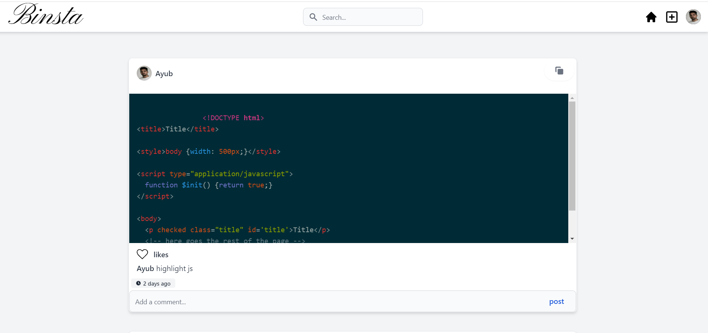

# Binsta

 _Binsta is a social media but built for developers where they share  code with others_.

* * *
### Demo
for a video demo, download a 'binsta.webm' file.

### Packages
### *highlightjs*
 I used the Package called **highlightjs** to implement syntax highlighting. You can check it out via [highlightjs](https://highlightjs.net "highlightjs")
* * * 

### Installation

 First clone & run **seeder.php**. It seeds ur database with existing data. Then you can open it via Localhost.

* * *
### Languages
 *  Twig
 *  CSS
 *  JavaScript
 *  PHP
 *  RedBean PHP
 *  MySQL

 * * *
 ### Contributors
 * Ayub: [ayyuubf321@gmail.com](https://gmail.google.com "gmail")
